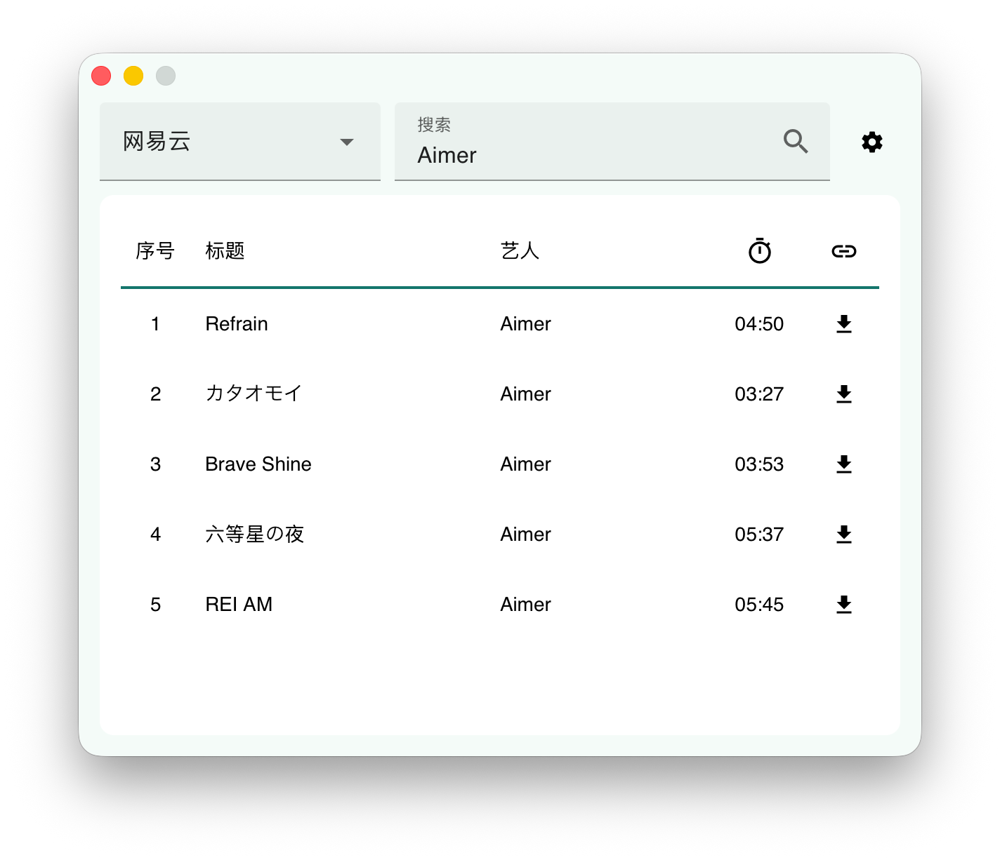

# MusicDL GUI

## 简介

这是一个基于[musicdl](https://github.com/CharlesPikachu/musicdl)的GUI程序  
核心组件[在这里](https://github.com/Zhoucheng133/MusicDL-Core)

这个仓库是基于Tauri的版本，另有基于PyQt6的版本  
★ Tauri ver. | [PyQt ver.](https://github.com/Zhoucheng133/MusicDL-PyQt)

## 功能

✅ 自定义下载位置  
✅ 自动编码下载的歌曲 (包括封面图片和meta信息)  
✅ 多个平台搜索  
✅ 深色模式

## 截图

